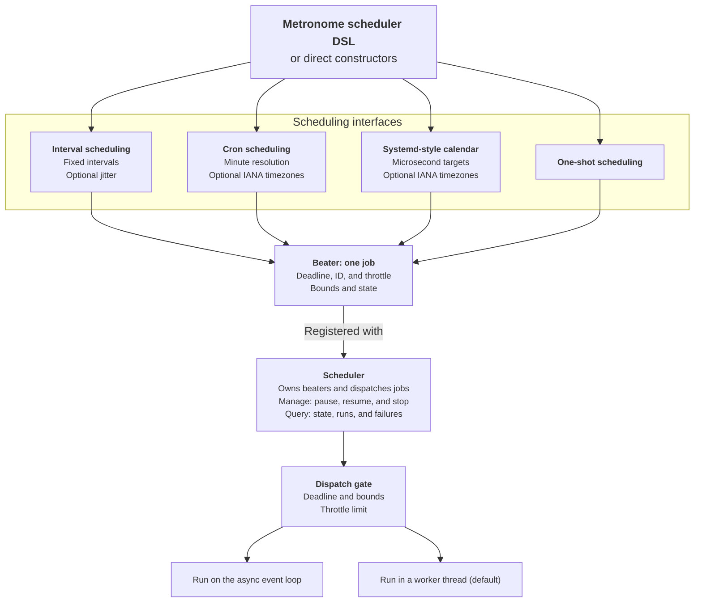

# Metronome

> [!WARNING]
> **Alpha software:** Metronome is a pre-1.0 package under active development.
> Its public API may change without compatibility guarantees.

[](https://github.com/titanomachy/Metronome/actions/workflows/ci.yml)
[](https://github.com/titanomachy/Metronome/actions)

Metronome is a Nim library for time-based job scheduling supporting cron jobs, systemd-style timers, interval-based timers, and one-shot tasks.

Read the [documentation](https://titanomachy.github.io/Metronome/metronome.html).

Features:

* Simple to use API for scheduling jobs.
* Support scheduling both async and sync procs.
* Interval, cron, systemd-style timers, and one-shot scheduling.
* Timezone-aware cron and systemd-style calendar schedules, including optional embedded IANA names.
* Job-level and scheduler-level async error handling.
* Pause, resume, stop, and inspect registered jobs by id.
* Optional interval jitter to spread out job launches.
* Zero-dependency code

## How Metronome Fits Together

Each schedule creates a beater that owns one job's timing and state. A
scheduler manages those beaters, applies lifecycle controls, and dispatches
due jobs through either the async event loop or a worker thread.



## Contents

- [Metronome](#metronome)
  - [How Metronome Fits Together](#how-metronome-fits-together)
  - [Contents](#contents)
  - [Getting Started](#getting-started)
  - [Usage](#usage)
    - [Thread Requirements](#thread-requirements)
  - [Advanced Usage](#advanced-usage)
    - [Cron](#cron)
      - [Cron Syntax](#cron-syntax)
    - [Schedule by Timer](#schedule-by-timer)
    - [One-Shot Jobs](#one-shot-jobs)
    - [Throttling](#throttling)
    - [Customize Scheduler](#customize-scheduler)
    - [Set Start Time and End Time](#set-start-time-and-end-time)
    - [Runnable Examples](#runnable-examples)
    - [Calculate Next Run Times](#calculate-next-run-times)
    - [Error Handling](#error-handling)
    - [Interval Jitter](#interval-jitter)
    - [Job Controls](#job-controls)
    - [Job Introspection](#job-introspection)
  - [ChangeLog](#changelog)
  - [Development](#development)
    - [Running Tests](#running-tests)
    - [Code Coverage](#code-coverage)
    - [Documentation](#documentation)
    - [Updating the embedded timezone database](#updating-the-embedded-timezone-database)
  - [License](#license)
  - [Attributions](#attributions)

## Getting Started

```bash
nimble update
nimble install metronome
```

If a feature is not yet in a release you can try to install from the latest commit.
```bash
nimble install metronome@#head
```

## Usage

This introductory example uses both execution paths: a regular procedure runs
in its own worker thread, while the procedure marked `async=true` runs on the
async event loop.

```nim
# File: examples/example_getting_started.nim
import metronome, times, asyncdispatch

metronome:
  every(seconds=10, id="tick"):
    echo("tick", now())

  every(seconds=10, id="atick", async=true):
    echo("tick", now())
    await sleepAsync(3000)
```

1. Schedule thread proc every 10 seconds.
2. Schedule async proc every 10 seconds.

Run:

```bash
nim c --threads:on -r examples/example_getting_started.nim
```

Scheduling is affected by system load, so launch times should not be treated as
real-time deadlines.

### Thread Requirements

Compile applications that import `metronome` with `--threads:on`:

```bash
nim c --threads:on your_app.nim
```

An `every`, `cron`, or `at` block without `async=true` becomes a thread-backed
job. Its body must satisfy Nim's thread and GC-safety rules, and blocking work
inside it blocks only that worker thread. A block with `async=true` runs on the
async event loop; use `await` for long-running work because blocking calls in
that body stall the event loop. Async job failures can be tracked and handled;
exceptions from thread-backed jobs are not propagated through job futures.

The repository's tests already enable threads through `tests/config.nims`, but
applications and ad hoc example builds should pass the flag explicitly.

## Advanced Usage

### Cron

You can use `cron` to schedule jobs using cron-like syntax.

```nim
import metronome, times, asyncdispatch

metronome:
  cron(minute="*/1", hour="*", day_of_month="*", month="*", day_of_week="*", id="tick"):
    echo("tick", now())

  cron(minute="*/1", hour="*", day_of_month="*", month="*", day_of_week="*", id="atick", async=true):
    echo("tick", now())
    await sleepAsync(3000)
```

1. Schedule thread proc every minute.
2. Schedule async proc every minute.

#### Cron Syntax

The `cron` macro accepts six string fields. Omitted fields default to `"*"`.
Cron scheduling has one-minute resolution.

| Field | Values | Names |
| --- | --- | --- |
| `minute` | `0-59` | — |
| `hour` | `0-23` | — |
| `day_of_month` | `1-31` | — |
| `month` | `1-12` | `jan` through `dec` |
| `day_of_week` | `1-7` | `mon` through `sun` |
| `year` | `1970-9999` | — |

Field text is case-insensitive. These forms can be combined in a field:

| Syntax | Meaning | Example |
| --- | --- | --- |
| `*` | every allowed value | `hour="*"` |
| `a,b` | a list of values | `minute="0,30"` |
| `a-b` | an inclusive range | `day_of_week="mon-fri"` |
| `*/n`, `a/n`, `a-b/n` | steps through all values, from a value, or through a range | `minute="*/5"` |
| `L` or `last` | last day of the month; `day_of_month` only | `day_of_month="L"` |
| `dL` | last weekday `d` of the month; `day_of_week` only | `day_of_week="friL"` |
| `d#n` | nth weekday `d` of the month; `day_of_week` only | `day_of_week="mon#3"` |

When both `day_of_month` and `day_of_week` are restricted, a date matching
either field is selected. Although the low-level parser currently recognizes
`?` and `W`, the next-run evaluator does not implement them; do not use those
forms in schedules.

Direct `newCron` calls expose a `second` argument for API compatibility, but
the current next-run calculation is minute-based and does not evaluate it.

Cron schedules can also be evaluated in a specific Nim `Timezone` by passing
`timezone=`. UTC needs no additional module:

```nim
import metronome, times, asyncdispatch, options

metronome:
  cron(hour="9", minute="0", id="utc-daily", async=true, timezone=utc()):
    echo("09:00 UTC ", now())
```

Direct `initBeater` calls accept `timezone=some(myTimezone)`.

For a named IANA zone, import the optional `metronome/timezones` module and
resolve the name once when constructing the scheduler:

```nim
import metronome, metronome/timezones
import asyncdispatch, times

# Change this one value to "America/Chicago" to move the schedule.
let zone = namedTimezone("Europe/Amsterdam")

scheduler localSched:
  cron(hour="9", minute="0", id="local-daily", async=true, timezone=zone):
    echo("09:00 local: ", now().inZone(zone))
```

Cron fields remain local wall-clock values. A 09:00 Amsterdam job therefore
runs at 08:00 UTC in winter and 07:00 UTC in summer. The embedded data is
cross-platform and does not read system zoneinfo files or perform runtime
downloads. Importing only `metronome` does not include or initialize it.
The `2026c` catalog is 411,023 bytes. In an illustrative stripped Linux x86-64
Nim 2.2.10 build, adding `metronome/timezones` increased a minimal executable
from 77,304 to 528,120 bytes; exact overhead depends on the target and compiler
settings.

Names are exact and case-sensitive. Canonical names and IANA aliases are
accepted, including `Etc/UTC` and `UTC`; `LOCAL`, numeric offsets, filesystem
paths, and unknown abbreviations are rejected. During a spring-forward gap, a
nonexistent local time is normalized forward. During a fall-back overlap, the
earlier occurrence is selected.

Use `timezoneDatabaseVersion()` to report the bundled IANA release and
`timezoneNames()` to list supported names. Database updates are application
updates: governments can change future rules, so applications should update
Metronome when a newer database is released. The generated API documentation
for this optional module is in
[`metronome/timezones`](https://titanomachy.github.io/Metronome/timezones.html).

See [example_cron_scheduler.nim](examples/example_cron_scheduler.nim) for
lists, `#`, and `L`, and
[example_cron_timezone.nim](examples/example_cron_timezone.nim) for timezone
handling.

### Schedule by Timer

Import the optional `metronome/timers` module to use a systemd-style
`OnCalendar` expression beside `every` and `cron`:

```text
Syntax: Year-Month-Day Hour:Minute:Second TimeZone
Example: OnCalendar=*-*-* 02:00:00 Europe/Amsterdam
```

```nim
import metronome
import metronome/timers

scheduler timerSched:
  timer(
    onCalendar="*-*-* 02:00:00 Europe/Amsterdam",
    id="nightly",
    async=true
  ):
    echo "Running nightly"
```

`metronome/timers` already includes the embedded timezone resolver used by
`OnCalendar` suffixes, so this example does not need a separate
`metronome/timezones` import. Import that module explicitly only when calling
its public APIs, such as `namedTimezone`, `timezoneNames`, or
`timezoneDatabaseVersion`, from application code.

The optional weekday prefix, `*`, comma-separated lists, `..` ranges, `/`
repetitions, `~` last-day forms, and the standard `minutely` through
`semiannually` shorthands are supported. A timer may also combine repeated
expressions:

```nim
let reporting = newTimer(["daily UTC", "Mon *-*-* 09:00:00 Europe/Amsterdam"])
```

Explicit `UTC` and exact embedded IANA names are resolved once. If the suffix
is omitted, the input `DateTime` timezone is used. Weekday and date constraints
must both match. Nonexistent wall-clock occurrences in a DST gap are skipped;
an overlap uses its earlier occurrence.

The seconds field accepts fractions, such as
`*-*-* *:*:00.123456 UTC`. Calendar matching and `getNext` retain one
microsecond of resolution, making timers more expressive than Metronome's
minute-resolution cron evaluator. The async event-loop wait is normally
millisecond-scale and affected by operating-system load, so dispatch is
best-effort rather than a real-time guarantee.

This interface models systemd's calendar-event grammar, not complete `.timer`
units. It does not implement `AccuracySec`, persistent catch-up, randomized
delay, monotonic boot timers, or wake-from-suspend. See the
[systemd calendar-event documentation](https://www.freedesktop.org/software/systemd/man/latest/systemd.time.html)
for the interface on which it is based and
[example_timer_scheduler.nim](examples/example_timer_scheduler.nim) for a
runnable example.

### One-Shot Jobs

Use `at` inside a `metronome` or `scheduler` block to schedule a job once at a
specific `DateTime`. One-shot jobs stop after their first launch. If a pending
one-shot job is paused and resumed before or after its scheduled time, it
remains pending and launches once.

```nim
import metronome, times, asyncdispatch

metronome:
  at(time=now()+initDuration(minutes=5), id="warm-cache", async=true):
    echo("warming cache")
```

Direct `initBeater` calls can also schedule a single run:

```nim
let beater = initBeater(
  now()+initDuration(minutes=5),
  proc(): Future[void] {.async.} = discard,
  id="warm-cache"
)
```

### Throttling

By default, only one instance of the job is to be scheduled at the same time.
If a job hasn't finished but the next run time has come, the next job will
not be scheduled.

You can allow more instances by specifying `throttle=`. For example:

```nim
import metronome, times, asyncdispatch, os

metronome:
  every(seconds=1, id="tick", throttle=2):
    echo("tick", now())
    sleep(2000)

  every(seconds=1, id="async tick", async=true, throttle=2):
    echo("async tick", now())
    await sleepAsync(4000)
```

### Customize Scheduler

Sometimes, you want to run the scheduler in parallel with other libraries.
In this case, you can create your own scheduler by macro `scheduler` and
start it later.

Below is an example showing how to run Metronome concurrently with the Prologue
web framework in one process. The scheduled job uses a GC-managed file logger,
so it runs on the shared async event-loop thread.

```nim
import std/[asyncdispatch, logging, times]
import metronome, prologue

let fileLogger = newFileLogger("messages.log", mode=fmAppend)

scheduler mySched:
  every(seconds=1, id="tick", async=true):
    let tickTime = now()
    echo("tick, seconds=1 ", tickTime)
    fileLogger.log(lvlInfo, "1 second tick: ", tickTime)

proc hello*(ctx: Context) {.async.} =
  resp "<h1>Hello, Prologue! It's alive!</h1>"

proc main() {.async.} =
  # Start the scheduler in the background of the async event loop
  asyncCheck mySched.start()

  # Keep Prologue and Metronome on the same async dispatcher. The default
  # blocking app.run() uses HTTPX worker threads and does not poll this loop.
  let settings = prologue.newSettings()
  var app = newApp(settings = settings)
  app.addRoute("/", hello)
  await app.runAsync()

when isMainModule:
  waitFor main()
```

The logger appends to `messages.log` in the process working directory. Prologue's
default HTTPX backend should use `runAsync()` as above so the main dispatcher
continues to run Metronome jobs. Run the example with:

```bash
nim c --threads:on -r examples/example_prologue.nim
```

An application that intentionally retains the blocking `app.run()` form can
instead select Prologue's standard async HTTP backend. For a Nimble binary
package like the test project, use:

```bash
nimble run -d:usestd
```

### Set Start Time and End Time

You can limit the schedules running in a designated range of time by specifying
`startTime` and `endTime`.

For example,

```nim
import metronome, times, asyncdispatch, os

scheduler demoSetRange:
  every(
    seconds=1,
    id="tick",
    startTime=initDateTime(2019, 1, 1),
    endTime=now()+initDuration(seconds=10)
  ):
    echo("tick", now())

when isMainModule:
  waitFor demoSetRange.start()
```

Parameters `startTime` and `endTime` can be used independently. For example,
you can set startTime only, or set endTime only.

### Runnable Examples

The examples are the runnable counterparts to the snippets in this guide:

* [example_getting_started.nim](examples/example_getting_started.nim) is the
  complete introductory example shown above.
* [example_basic_intervals.nim](examples/example_basic_intervals.nim) covers
  sync and async intervals, throttling, and a bounded time window.
* [example_async_jobs.nim](examples/example_async_jobs.nim) demonstrates a
  finite async scheduler run.
* [example_blocking.nim](examples/example_blocking.nim) combines thread-backed
  and async interval and cron jobs.
* [example_cron_scheduler.nim](examples/example_cron_scheduler.nim) covers
  lists and the weekday `#` and `L` forms.
* [example_cron_timezone.nim](examples/example_cron_timezone.nim) demonstrates
  cron scheduling with named IANA timezones.
* [example_timer_scheduler.nim](examples/example_timer_scheduler.nim)
  demonstrates Systemd-style `OnCalendar` timers with named timezones and
  microsecond calendar targets.
* [example_firetime_calculations.nim](examples/example_firetime_calculations.nim)
  and [example_one_shot.nim](examples/example_one_shot.nim) cover their matching
  sections above.
* [example_prologue.nim](examples/example_prologue.nim) shows async integration
  with Prologue and a file logger, and requires Prologue in addition to
  Metronome.

Compile a standalone example with threads enabled, for example:

```bash
nim c --threads:on -r examples/example_async_jobs.nim
```

### Calculate Next Run Times

Use `fireTime` to inspect the next scheduled run without starting a scheduler.
This is useful for tests, dashboards, and checking interval or cron behavior
deterministically.

```nim
import metronome, times, options, asyncdispatch

proc noop(): Future[void] {.async.} = discard

let current = dateTime(2026, mJan, 1, 12, 35, 0, 0, utc())
let beater = initBeater(
  initTimeInterval(minutes=10),
  noop,
  startTime=some(dateTime(2026, mJan, 1, 12, 0, 0, 0, utc()))
)

echo beater.fireTime(none(DateTime), current).get()
```

### Error Handling

Schedulers keep running when a scheduled async job fails. Failed job futures are
recorded on the beater and can be passed to either a scheduler-level error
handler or a job-level error handler. Job-level handlers take precedence.
Error handlers are supported for async jobs only; thread-backed sync jobs do not
propagate exceptions through their returned futures.

```nim
import metronome, asyncdispatch, times

proc handleSchedulerError(fut: Future[void]) {.gcsafe.} =
  echo("job failed: ", fut.readError().msg)

proc handleJobError(fut: Future[void]) {.gcsafe.} =
  echo("specific job failed: ", fut.readError().msg)

let sched = initScheduler(newSettings(errorHandler=handleSchedulerError))
sched.register(initBeater(
  initTimeInterval(seconds=1),
  proc(): Future[void] {.async.} =
    raise newException(ValueError, "boom"),
  id="failing-job",
  errorHandler=handleJobError
))

asyncCheck sched.start()
```

The `every` and `cron` macros also support job-level handlers on async jobs
using `onError=`.

```nim
scheduler sched:
  every(seconds=1, id="failing-job", async=true, onError=handleJobError):
    raise newException(ValueError, "boom")
```

Use `lastError(id)`, `lastErrorAt(id)`, and `failures(id)` to inspect failure
state for a registered job.

### Interval Jitter

Interval jobs can add a non-negative random delay to each computed run time with
`jitter`. This is useful when many jobs or application instances would otherwise
launch at the same instant. Jitter is only supported for interval schedules, not
cron schedules.

```nim
import metronome, asyncdispatch, times

scheduler sched:
  every(minutes=5, id="spread-out", async=true, jitter=initTimeInterval(seconds=30)):
    echo("tick ", now())
```

The example above runs every five minutes plus a random delay from `0` to `30`
seconds. Direct `initBeater` calls accept the same `jitter` parameter:

```nim
let beater = initBeater(
  initTimeInterval(minutes=5),
  proc(): Future[void] {.async.} = discard,
  id="spread-out",
  jitter=initTimeInterval(seconds=30)
)
```

### Job Controls

Schedulers can pause, resume, and stop registered jobs by id. Anonymous jobs can
still be registered, but ID-based controls only work when an id uniquely
identifies one registered job.

`pause(id)` prevents future launches for that job. Already-running job futures
are not cancelled. While paused, `nextRun(id)` is cleared; when resumed, interval
jobs schedule from the current time instead of replaying every interval missed
during the pause.

`resume(id)` returns a paused job to normal scheduling. `stop(id)` permanently
stops one job and clears its next run time. `stopAll()` permanently stops all
registered jobs. The ID-based control procs return `true` when exactly one job
matches the id and `false` when the id is missing, empty, or ambiguous.

```nim
import metronome, asyncdispatch, times

let sched = initScheduler(newSettings())
sched.register(initBeater(initTimeInterval(seconds=10), proc(): Future[void] {.async.} = discard, id="tick"))

discard sched.pause("tick")
discard sched.resume("tick")
discard sched.stop("tick")
sched.stopAll()
```

### Job Introspection

Schedulers expose runtime state for dashboards, logs, tests, and health checks.
Like controls, ID-based introspection only returns job data when exactly one
registered job has that non-empty id. Missing, empty, anonymous, or duplicate ids
return `none(...)`, `nil`, or `0` depending on the accessor.

```nim
import metronome, asyncdispatch, times, options

let sched = initScheduler(newSettings())
sched.register(initBeater(initTimeInterval(seconds=10), proc(): Future[void] {.async.} = discard, id="tick"))

echo sched.listJobs()

echo sched.jobState("tick")
echo sched.lastRun("tick")
echo sched.nextRun("tick")
echo sched.lastError("tick")
echo sched.lastErrorAt("tick")
echo sched.failures("tick")
echo sched.runningCount("tick")
```

`listJobs()` returns all non-empty registered ids, including duplicates. Use
`jobState(id)` to inspect whether a job is running, paused, or stopped.
`lastRun(id)` and `nextRun(id)` return `Option[DateTime]` values. `lastError(id)`
returns the most recent exception or `nil`; `lastErrorAt(id)` and `failures(id)`
report when and how often the job failed. `runningCount(id)` reports currently
running job futures for that scheduled job.

## ChangeLog

Released:

* v0.4.0, 11 Jul, 2026, Renamed library to Metronome, updated all references, documentation and examples
* v0.3.1, 10 Jul, 2026, Add async job error handling, job lifecycle and introspection APIs, one-shot and timezone-aware scheduling, interval jitter, and expanded tests, CI, and documentation.
* v0.3.0, 8 Jul, 2026, Upgrade to Nim 2.2.10, resolve warnings, fix weekday index/last bugs, expand tests, and add CI coverage.
* v0.2.0, 22 Jul, 2021, New feature: cron.
* v0.1.2, 8 Jul, 2021, Bugfix: the first job schedule should be after startTime.
* v0.1.1, update metadata.
* v0.1.0, initial release.

## Development

### Running Tests

To run the automated unit tests:

```bash
nimble test
```

### Code Coverage

Install `lcov` and `genhtml`, then run the canonical coverage task:

```bash
nimble coverage
```

The task runs all instrumented tests, captures and filters project coverage,
generates `coverage_html/index.html`, and updates `docs/coverage.svg`. CI invokes
the same task, requires at least 80% line coverage, and publishes the generated
badge with the documentation. Generated coverage files are not committed.

### Documentation

To generate the HTML documentation locally:

```bash
nimble docs
```

This compiles the root scheduler documentation and the optional named-timezone
and calendar-timer modules, then outputs the generated files directly into the
ignored `docs/` folder. You can open `docs/metronome.html` for the scheduler API,
`docs/timezones.html` for named IANA timezone support, or `docs/timers.html`
for systemd-style calendar timers. On pushes to `master`, CI deploys this folder
to GitHub Pages as an artifact instead of committing generated files to the
repository.

### Updating the embedded timezone database

The maintainer-only updater pins and verifies matching IANA `tzdata` and
`tzcode` releases. It builds that release's `zic`; it never silently uses the
host's installed `zic`.

```bash
nim r tools/update_timezones.nim -- 2026c
nim r tools/update_timezones.nim -- 2026c --check
```

The updater requires `curl`, `sha256sum`, `tar`, `make`, and a C99 compiler.
Applications do not need these tools. Updating the pin requires reviewing and
changing both committed SHA-256 checksums in the updater.

## License

Metronome is licensed under the MIT License.

## Attributions

* [@soasme](https://github.com/soasme) originally created the scheduler base of this library ([nim-schedules](https://github.com/soasme/nim-schedules)).
* [@GULPF](https://github.com/GULPF) originally created the timezones base of this library ([timezones](https://github.com/GULPF/timezones)).

Portions of both libraries were adapted under the MIT License.
